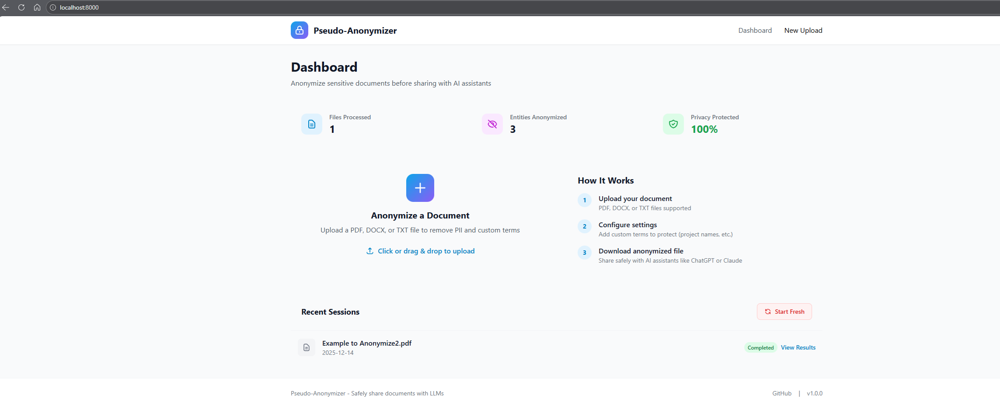
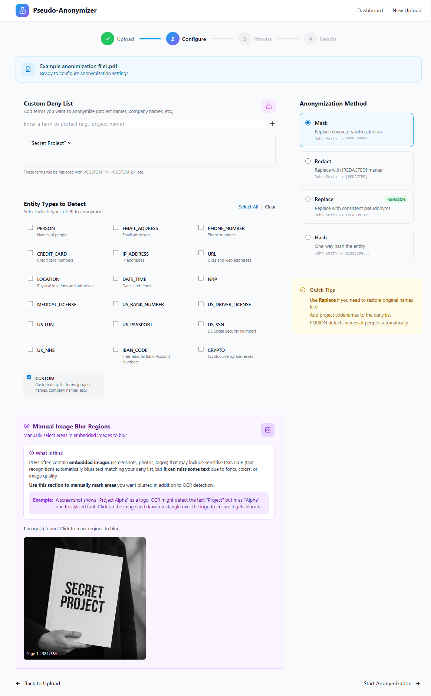
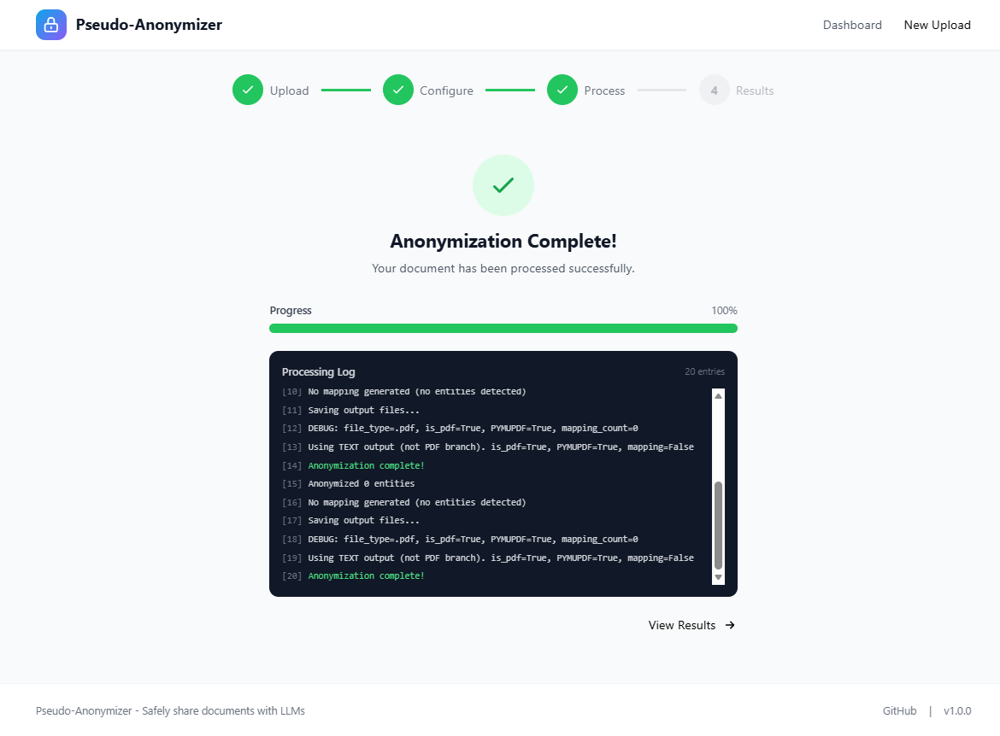
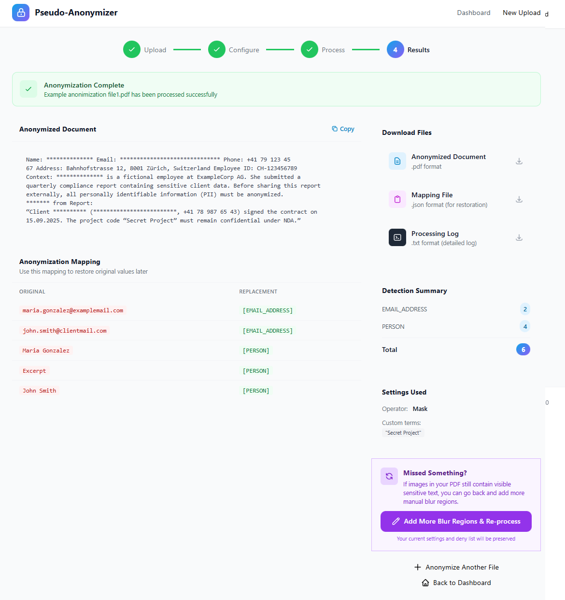
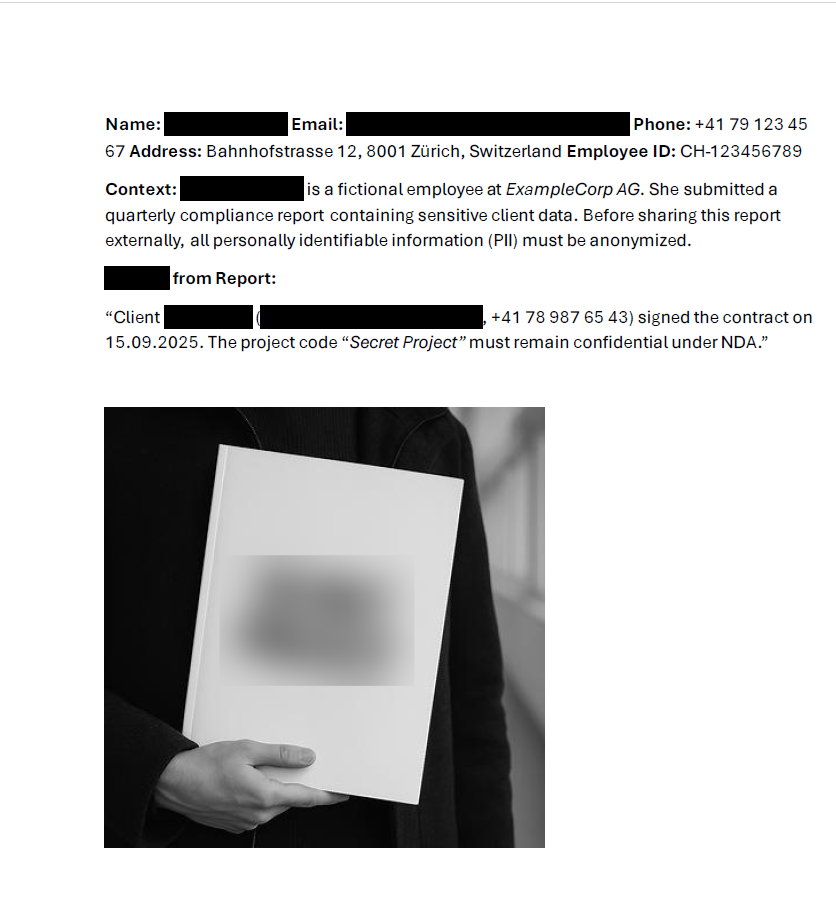

# Pseudo-Anonymizer

<p align="center">
  
</p>

**Anonymize sensitive documents before sharing them with AI assistants like ChatGPT or Claude.**

Detects PII (names, emails, phones, etc.) and custom terms (project names, company names under NDA) and replaces them with consistent pseudonyms. Also blurs sensitive text in images embedded in PDFs using OCR.

## Why Use This?

You want to use AI assistants to help with a confidential document, but you can't share real names, project codenames, or company information. This tool:

1. **Anonymizes** your document (PDF, DOCX, TXT)
2. You share the **safe version** with Copilot Chat/ChatGPT/Claude
3. **De-anonymize** the AI's response to restore original names

---

## Table of Contents

- [Features](#features)
- [Installation](#installation)
  - [Windows](#windows)
  - [macOS](#macos)
  - [Linux](#linux)
- [Quick Start](#quick-start)
- [Web GUI Usage](#web-gui-usage-step-by-step)
- [CLI Usage](#cli-usage)
- [Operators](#operators)
- [Custom Deny Lists](#custom-deny-lists)
- [Troubleshooting](#troubleshooting)
- [License](#license)

---

## Features

- **PII Detection**: Automatically detects names, emails, phone numbers, credit cards, SSNs, and more using Microsoft Presidio
- **Custom Deny Lists**: Add project names, company names, or any NDA-protected terms
- **PDF-to-PDF Output**: Maintains original PDF formatting with text replacements
- **Image Text Blurring**: OCR-based detection and blurring of text in embedded images
- **Manual Blur Regions**: Draw rectangles on images to blur areas OCR might miss
- **Reversible Anonymization**: Save mappings to restore original names later
- **Web GUI**: Easy-to-use browser interface (no command line required)
- **CLI**: Scriptable command-line interface for automation

---

## Installation

### Prerequisites

- **Python 3.9+** (3.10 or 3.11 recommended)
- **Tesseract OCR** (required for image text detection)

---

### Windows

#### Step 1: Install Python

1. Download Python from [python.org](https://www.python.org/downloads/)
2. **Important**: Check "Add Python to PATH" during installation
3. Verify installation:
   ```cmd
   python --version
   ```

#### Step 2: Install Tesseract OCR

1. Download the installer from [UB-Mannheim/tesseract](https://github.com/UB-Mannheim/tesseract/wiki)
2. Run the installer (default path: `C:\Program Files\Tesseract-OCR`)
3. The tool will auto-detect this path

#### Step 3: Clone and Setup

```cmd
# Clone the repository
git clone https://github.com/aalejandroaraujo/Pseudoanonymization.git
cd Pseudoanonymization/pseudo-anonymizer

# Create virtual environment
python -m venv venv
venv\Scripts\activate

# Install dependencies
pip install -r requirements.txt

# Download spaCy language model
python -m spacy download en_core_web_sm
```

#### Step 4: Run the Web GUI

```cmd
python -m uvicorn web.app:app --host 127.0.0.1 --port 8000
```

Open your browser to **http://localhost:8000**

---

### macOS

#### Step 1: Install Python (if not already installed)

```bash
# Using Homebrew (recommended)
brew install python@3.11
```

#### Step 2: Install Tesseract OCR

```bash
brew install tesseract
```

#### Step 3: Clone and Setup

```bash
# Clone the repository
git clone https://github.com/aalejandroaraujo/Pseudoanonymization.git
cd Pseudoanonymization/pseudo-anonymizer

# Create virtual environment
python3 -m venv venv
source venv/bin/activate

# Install dependencies
pip install -r requirements.txt

# Download spaCy language model
python -m spacy download en_core_web_sm
```

#### Step 4: Run the Web GUI

```bash
python -m uvicorn web.app:app --host 127.0.0.1 --port 8000
```

Open your browser to **http://localhost:8000**

---

### Linux (Ubuntu/Debian)

#### Step 1: Install Python and pip

```bash
sudo apt update
sudo apt install python3 python3-pip python3-venv
```

#### Step 2: Install Tesseract OCR

```bash
sudo apt install tesseract-ocr
```

#### Step 3: Clone and Setup

```bash
# Clone the repository
git clone https://github.com/aalejandroaraujo/Pseudoanonymization.git
cd Pseudoanonymization/pseudo-anonymizer

# Create virtual environment
python3 -m venv venv
source venv/bin/activate

# Install dependencies
pip install -r requirements.txt

# Download spaCy language model
python -m spacy download en_core_web_sm
```

#### Step 4: Run the Web GUI

```bash
python -m uvicorn web.app:app --host 127.0.0.1 --port 8000
```

Open your browser to **http://localhost:8000**

---

## Quick Start

After installation, the fastest way to get started:

```bash
# Activate virtual environment (if not already active)
# Windows: venv\Scripts\activate
# macOS/Linux: source venv/bin/activate

# Start the web server
python -m uvicorn web.app:app --host 127.0.0.1 --port 8000

# Open http://localhost:8000 in your browser
```

---

## Web GUI Usage (Step-by-Step)

### Step 1: Dashboard

Upload a document by clicking the upload area or dragging and dropping a file.

<p align="center">
  
</p>

**Supported formats:** PDF, DOCX, TXT, PNG, JPG

---

### Step 2: Configure Settings

<p align="center">
  
</p>

**Configure your anonymization:**

1. **Custom Deny List**: Add terms you want anonymized (project names, company names, etc.)
2. **Entity Types**: Select which PII types to detect (names, emails, phones, etc.)
3. **Anonymization Method**:
   - **Mask**: Replace with asterisks (`John` -> `****`)
   - **Replace**: Use pseudonyms (`John` -> `<PERSON_1>`) - *reversible*
   - **Redact**: Replace with `[REDACTED]`
   - **Hash**: SHA256 hash

**For PDFs with images:** Use the **Manual Image Blur Regions** section to draw rectangles over sensitive areas that OCR might miss (logos, stylized text, etc.)

---

### Step 3: Processing

<p align="center">
  
</p>

Watch real-time progress as the tool:
- Extracts text from your document
- Detects PII entities
- Processes images with OCR
- Applies blur to matched text regions

---

### Step 4: Download Results

<p align="center">
  
</p>

**Download your files:**

1. **Anonymized Document**: The safe version to share with AI

<p align="center">
  
</p>

2. **Mapping File**: JSON file to restore original names later
3. **Processing Log**: Detailed log of what was detected and replaced

**Missed something?** For PDFs, click "Add More Blur Regions & Re-process" to go back and mark additional areas.

---

## CLI Usage

For automation or command-line workflows:

```bash
cd pseudo-anonymizer

# Basic anonymization
python main.py anonymize -i document.pdf

# With custom deny list and saved mapping
python main.py anonymize -i confidential.pdf --deny-list "Acme,Internal" --save-mapping mapping.json

# De-anonymize AI response
python main.py de-anonymize -i chatgpt_response.txt -m mapping.json -o final.txt

# Blur text in standalone images
python main.py blur-image -i screenshot.png --blur-all
```

### Complete Workflow Example

```bash
# 1. Anonymize your document
python main.py anonymize -i confidential.pdf --save-mapping mapping.json -o safe.txt

# 2. Copy safe.txt content, paste into ChatGPT/Claude

# 3. Save AI response to file, then restore original names
python main.py de-anonymize -i response.txt -m mapping.json -o final.txt
```

---

## Operators

| Operator | What it does | Example | Reversible |
|----------|--------------|---------|:----------:|
| `mask` | Replace with asterisks | `John Smith` -> `**********` | No |
| `replace` | Consistent pseudonyms | `John Smith` -> `<PERSON_1>` | **Yes** |
| `redact` | [REDACTED] marker | `John Smith` -> `[REDACTED]` | No |
| `hash` | SHA256 hash | `John Smith` -> `a1b2c3...` | No |

**Tip:** Use `replace` if you need to restore original names in AI responses.

---

## Custom Deny Lists

Beyond standard PII, anonymize project codenames, company names, or any NDA-protected terms:

**In Web GUI:** Add terms in the "Custom Deny List" section

**In CLI:**
```bash
# Inline list
python main.py anonymize -i doc.pdf --deny-list "Acme,Internal,ClientName"

# From file (one term per line)
python main.py anonymize -i doc.pdf --deny-list deny_terms.txt
```

---

## Directory Structure

```
Pseudoanonymization/
└── pseudo-anonymizer/
    ├── main.py              # CLI entry point
    ├── anonymizer.py        # PII detection (Microsoft Presidio)
    ├── file_handler.py      # PDF/DOCX/TXT text extraction
    ├── image_anonymizer.py  # OCR + blur for standalone images
    ├── pdf_anonymizer.py    # PDF-to-PDF output with image processing
    ├── mapping_manager.py   # Save/load anonymization mappings
    ├── config.py            # Application settings
    ├── web/
    │   ├── app.py           # FastAPI web backend
    │   ├── templates/       # Jinja2 HTML templates
    │   └── static/          # CSS/JS assets
    ├── docs/                # Screenshots and documentation
    └── requirements.txt     # Python dependencies
```

---

## Troubleshooting

### "spacy model not found"
```bash
python -m spacy download en_core_web_sm
```

### "Tesseract not found" / OCR not working

**Windows:** Download and install from [UB-Mannheim/tesseract](https://github.com/UB-Mannheim/tesseract/wiki)

**macOS:** `brew install tesseract`

**Linux:** `sudo apt install tesseract-ocr`

### PDF returns empty text
The PDF is likely image-based (scanned). The tool will still process embedded images with OCR, but native text extraction won't work on scanned documents.

### OCR not detecting text in images
- Check the processing log for detected words
- Use the **Manual Image Blur Regions** feature to draw over areas OCR missed
- Stylized/artistic fonts may not be recognized
- Very small text may not be detected even with 3x scaling

### Web GUI won't start
```bash
# Make sure you're in the right directory
cd pseudo-anonymizer

# Make sure virtual environment is activated
# Windows: venv\Scripts\activate
# macOS/Linux: source venv/bin/activate

# Try a different port if 8000 is in use
python -m uvicorn web.app:app --host 127.0.0.1 --port 8080
```

---

## Technical Details

### OCR Processing Pipeline

For PDFs with embedded images:
1. **3x image scaling** - Upscales for better OCR accuracy
2. **Multi-pass OCR** - 7 preprocessing variants (standard, inverted, grayscale, binary, etc.)
3. **Fuzzy matching** - Levenshtein distance with 80% threshold catches OCR typos
4. **Low confidence threshold** - Accepts results down to 15% confidence

### Security Note

This tool runs locally - your documents never leave your machine. No data is sent to external servers.

---

## Vibe Code Alert

99% of this repo was vibe coded with Claude. The code works but don't expect production-grade engineering. PRs welcome if you want to clean things up!

---

## License

MIT License - feel free to use, modify, and distribute.

---

## Contributing

Issues and pull requests are welcome! Areas that could use improvement:
- Support for more languages (currently English only)
- Better OCR for stylized fonts
- Batch processing multiple files
- Docker container for easier deployment

---

**Made with Perplexity, Claude Code, Manus AI and ChatGPT**
